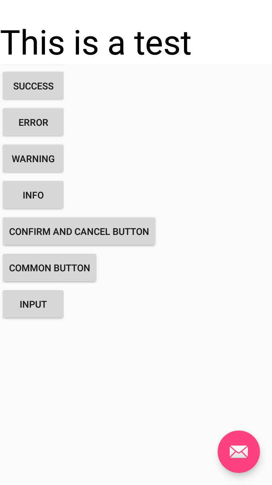
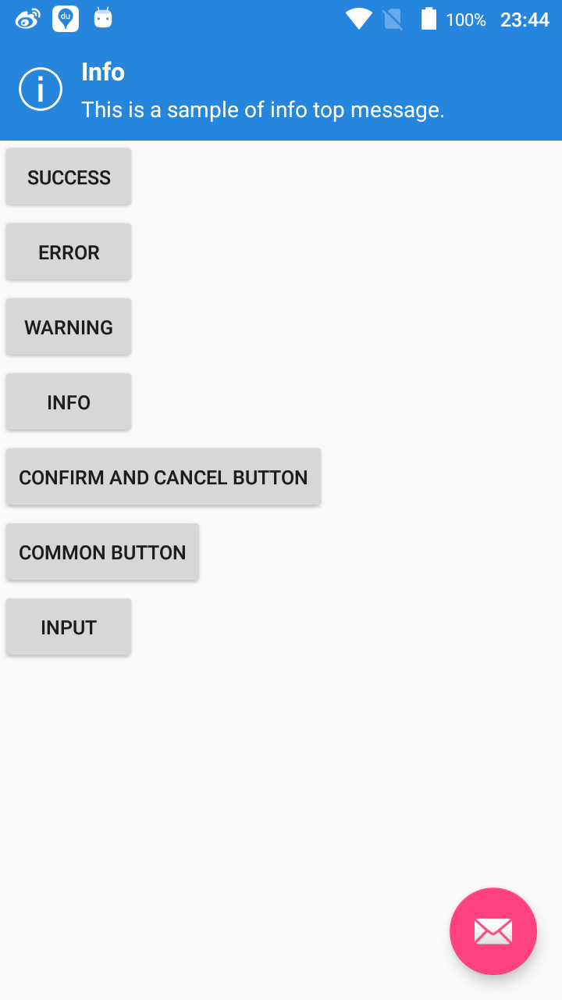
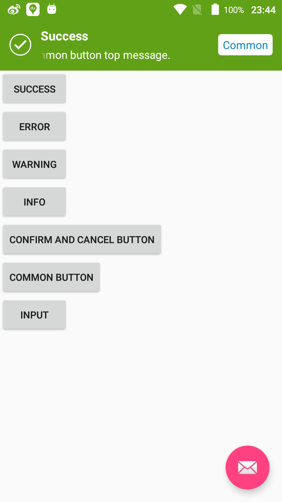

### BannerView

[](https://jitpack.io/#BestDI/BannerView)
------

### How to init it?

To get a Git project into your build:

##### Step 1. Add the JitPack repository to your build file

in `gradle`,
Add it in your root build.gradle at the end of repositories:

```
allprojects {
    repositories {
        ...
        maven { url 'https://jitpack.io' }
    }
}
```

##### Step 2. Add the dependency

```
dependencies {
    implementation 'com.github.BestDI:BannerView:v1.0.0'
}
```

### How to use it?

##### Step 1. init it in your application

```kotlin
override fun onCreate() {
    super.onCreate()
    registerActivityLifecycleCallbacks(BannerViewLifecycleHandler.INSTANCE)
}
```

##### Step 2. Then you could use in your activity or fragment

```kotlin
//way1
BannerViewManager.show(view: View) // you could use with your custom view

//way2
BannerViewManager.showCommonBanner(
                              level: Level = Level.INFO,
                              duration: Duration = Duration.MEDIUM,
                              message: String,
                              title: String? = null,
                              commonButtonText: String? = null,
                              commonButtonListener: CommonButtonListener? = null
                      )

//way3
BannerViewManager.showConfirmCancelBanner(
                              level: Level = Level.INFO,
                              duration: Duration = Duration.MEDIUM,
                              message: String,
                              title: String? = null,
                              confirmText: String? = null,
                              cancelText: String? = null,
                              confirmCancelListener: ConfirmCancelListener? = null
                      )

```

you could define class extend Level to define custom bg color or icon.

### result

------

show:



-------

showCommonBanner:



-------

showConfirmCancelBanner:

